<div align="center">

# 🎬 MoneyPrinter Studio

### Autonomous AI Documentary Studio & Production Pipeline for Multi-Episode Video Generation

**Research Grounding • LLM Scriptwriting • AI Shot Direction • ComfyUI SDXL • Edge/Azure TTS • Fitted Pill Karaoke Subtitles • Hardware NVENC • Durable State Machine**

[](https://www.python.org/)
[](LICENSE)
[](https://developer.nvidia.com/video-encode-decode-gpu-support-matrix)
[](https://api.deepseek.com)
[](https://github.com/comfyanonymous/ComfyUI)
[](#-system-requirements)

<p align="center">
  <a href="#-visual-showcase--gallery">Showcase Gallery</a> •
  <a href="#-system-architecture">System Architecture</a> •
  <a href="#-deep-dive-subsystems">Subsystems Deep-Dive</a> •
  <a href="#-niche-profiles-catalogue">Niche Profiles (14)</a> •
  <a href="#-installation--setup">Installation</a> •
  <a href="#-configuration-reference">Configuration Guide</a> •
  <a href="#-cli-reference">CLI Reference</a> •
  <a href="#-production-deployment">Production & Daemon</a> •
  <a href="#-troubleshooting">Troubleshooting</a>
</p>

</div>

---

## 📽️ Visual Showcase & Gallery

The **MoneyPrinter Studio** operates entire documentary verticals without human intervention: topic brainstorming, factual research synthesis, scriptwriting with strict timing constraints, sentence-level shot planning, visual routing, audio synchronization, GPU compositing, high-contrast thumbnail rendering, and crash-resilient batch execution.

### Dynamic Video & Subtitle Motion Previews

<div align="center">

| Deep Sea / Space Preview (320x569) | "What If" Catastrophes Preview (320x568) |
| :---: | :---: |
|  |  |
| *Edge-TTS + Word-Aligned Montserrat Pill Karaoke + 2.5D Motion* | *Hypothetical Physics + Rapid Pacing + NVENC Compositing* |

</div>

---

### Autonomous Series Gallery (Real Generated Outputs)

Every image below represents an episode produced autonomously by the pipeline, complete with chronological archiving and high-CTR thumbnail rendering:

#### 🌌 Space Anomalies (`profiles/space_anomalies.toml`)
| Ep 1: The 1977 Wow! Signal | Ep 2: The Mystery of Oumuamua | Ep 3: Tabby's Star Dyson Swarm | Ep 4: The Boötes Void |
| :---: | :---: | :---: | :---: |
|  |  |  |  |
| **Duration**: 107s \| **Size**: 21 MB | **Duration**: 100s \| **Size**: 59 MB | **Duration**: 116s \| **Size**: 37 MB | **Duration**: 97s \| **Size**: 22 MB |

#### 🌊 Deep Sea Horrors (`profiles/deep_sea.toml`)
| Ep 1: The 1997 Bloop Signal | Ep 3: Point Nemo Graveyard | Ep 4: The Baltic Sea Monolith | Ep 5: Hadal Zone Gigantism |
| :---: | :---: | :---: | :---: |
|  |  |  |  |
| **Duration**: 103s \| **Size**: 20 MB | **Duration**: 119s \| **Size**: 35 MB | **Duration**: 109s \| **Size**: 23 MB | **Duration**: 103s \| **Size**: 45 MB |

#### ☄️ What If Scenarios & Catastrophes (`profiles/what_if.toml`)
| Ep 1: Earth Stops Spinning (5s) | Ep 2: Moon Disappears | Ep 3: Yellowstone Erupts | Ep 4: Sun Vanishes (7 Days) |
| :---: | :---: | :---: | :---: |
| 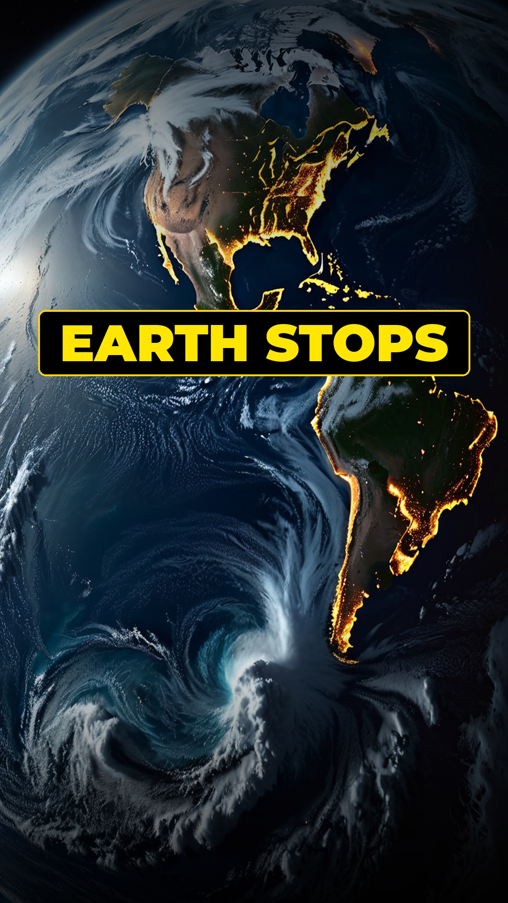 | *(Dynamic AI Production)* | *(Dynamic AI Production)* | *(Dynamic AI Production)* |
| **Duration**: 53s \| **Size**: 14 MB | **Duration**: 55s \| **Size**: 15 MB | **Duration**: 58s \| **Size**: 16 MB | **Duration**: 52s \| **Size**: 14 MB |

#### 🦖 Prehistoric Earth (`profiles/prehistoric.toml`)
| Ep 1: Titanoboa (42-Foot Monster) | Ep 2: Permian Mass Extinction | Ep 3: Megalodon vs Livyatan | Ep 4: Dunkleosteus |
| :---: | :---: | :---: | :---: |
| 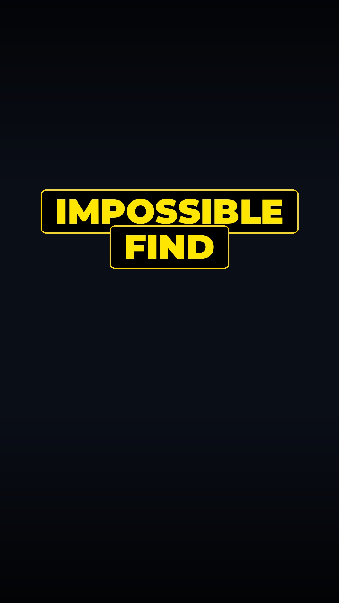 | 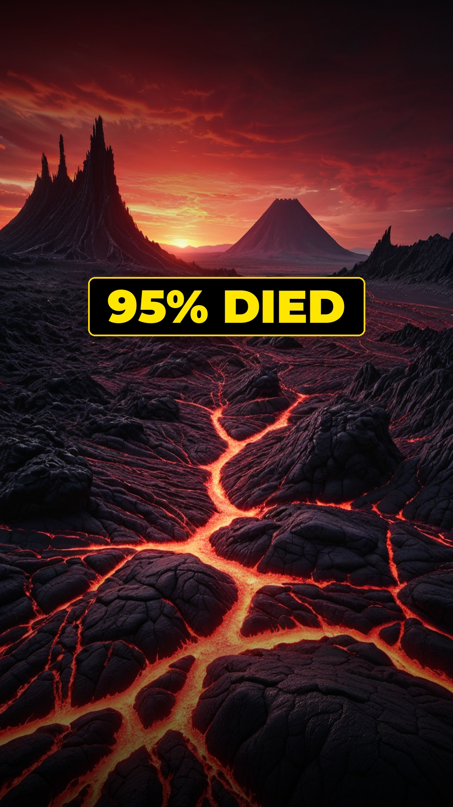 |  | 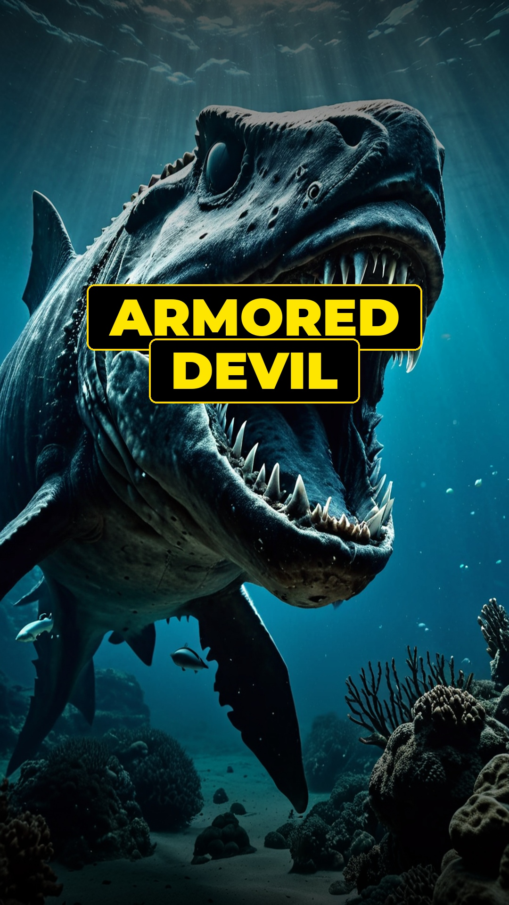 |
| **Duration**: 54s \| **Size**: 30 MB | **Duration**: 56s \| **Size**: 24 MB | **Duration**: 58s \| **Size**: 35 MB | **Duration**: 52s \| **Size**: 28 MB |

#### 🪖 Military Black Ops & Declassified (`profiles/military_black_ops.toml`)
| Ep 1: Project Pluto (Nuclear Ramjet) | Ep 2: Skunk Works SR-71 Blackbird | Ep 3: Project Azorian (Submarine Heist) |
| :---: | :---: | :---: |
| 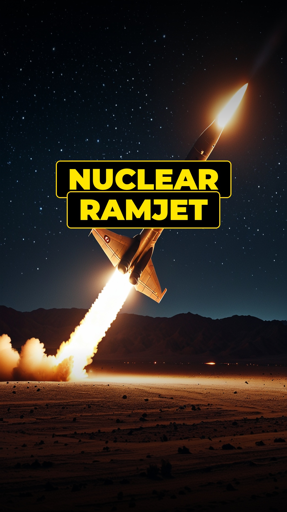 |  | 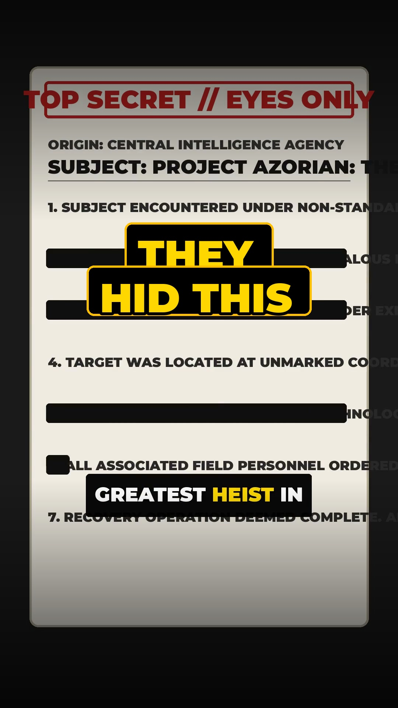 |
| **Duration**: 57s \| **Size**: 29 MB | **Duration**: 53s \| **Size**: 18 MB | **Duration**: 55s \| **Size**: 19 MB |

#### 🏛️ Forbidden Archaeology (`profiles/forbidden_archaeology.toml`)
| Ep 1: Göbekli Tepe (11,500 Yrs Old) | Ep 2: Derinkuyu 18-Story Underground City | Ep 3: Yonaguni Sunken Megalith |
| :---: | :---: | :---: |
| 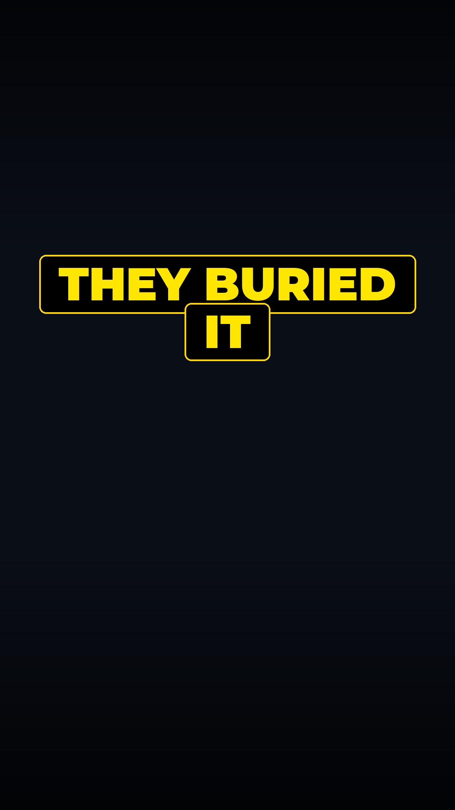 | 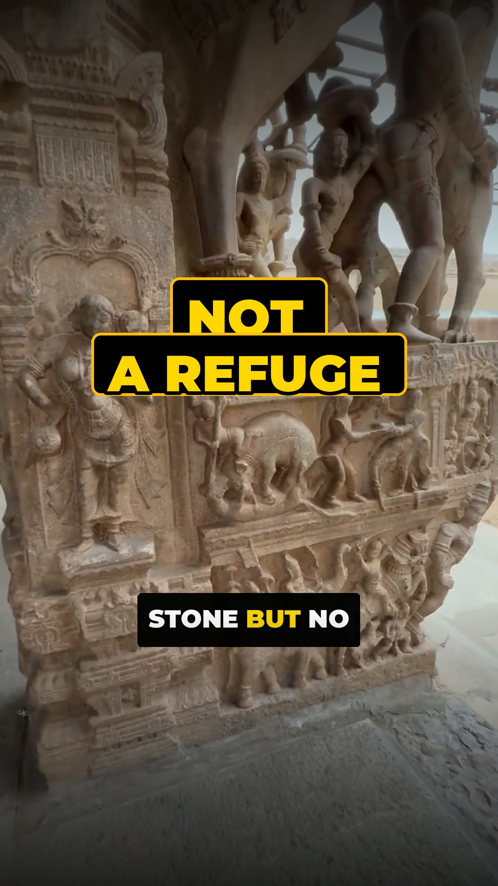 | 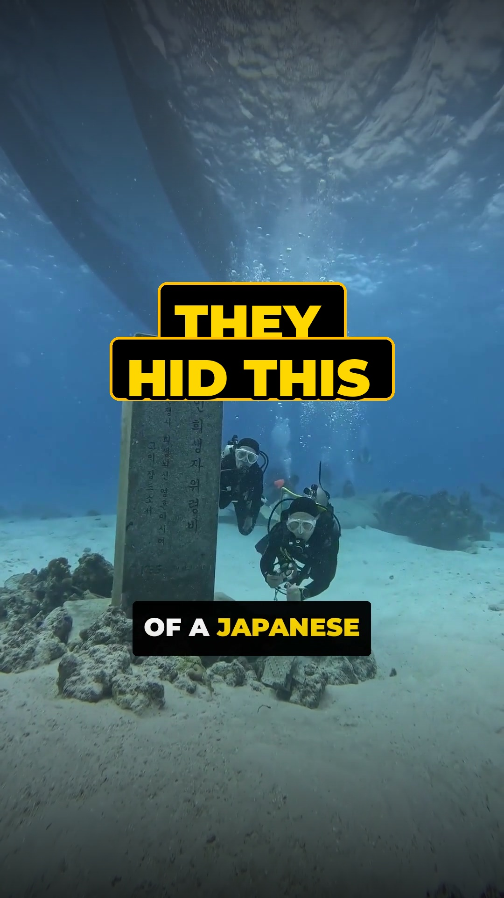 |
| **Duration**: 56s \| **Size**: 32 MB | **Duration**: 54s \| **Size**: 24 MB | **Duration**: 58s \| **Size**: 39 MB |

#### ❓ Chilling Unsolved Mysteries (`profiles/unsolved_mysteries.toml`)
| Ep 1: 1959 Dyatlov Pass Incident | Ep 2: 1908 Tunguska Blast (Megaton) | Ep 3: Cicada 3301 Dark Web Enigma |
| :---: | :---: | :---: |
| 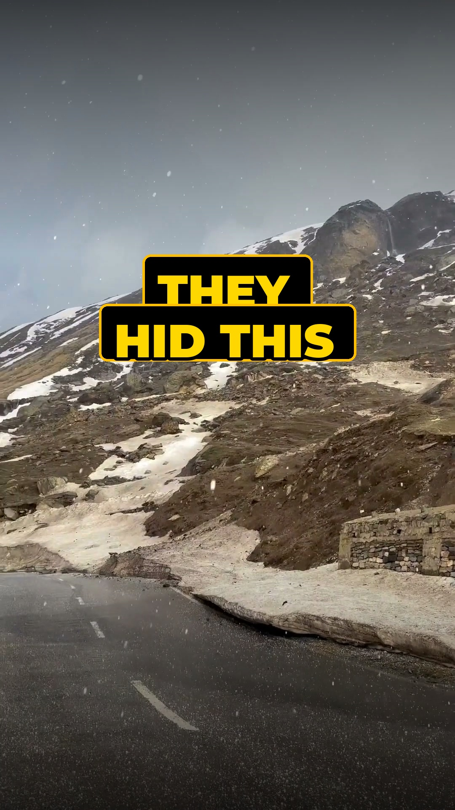 |  |  |
| **Duration**: 57s \| **Size**: 27 MB | **Duration**: 55s \| **Size**: 34 MB | **Duration**: 54s \| **Size**: 29 MB |

#### 💎 World's Greatest Heists (`profiles/money_heists.toml`)
| Ep 1: Antwerp Diamond Center Heist | Ep 2: Hatton Garden Vault Breach | Ep 4: Gardner Museum Art Robbery |
| :---: | :---: | :---: |
|  |  |  |
| **Duration**: 114s \| **Size**: 24 MB | **Duration**: 106s \| **Size**: 18 MB | **Duration**: 92s \| **Size**: 29 MB |

#### 🕵️ True Crime & Cold Cases (`profiles/true_crime.toml`)
| Ep 1: The Yuba County Five | Ep 2: D.B. Cooper Skyjacking | Ep 4: Hinterkaifeck Murders |
| :---: | :---: | :---: |
|  |  |  |
| **Duration**: 114s \| **Size**: 38 MB | **Duration**: 99s \| **Size**: 18 MB | **Duration**: 112s \| **Size**: 40 MB |

#### 🧠 Dark Psychology (`profiles/psychology.toml`)
| Ep 1: Project MK-Ultra Subproject 68 | Ep 2: The Monster Study | Ep 3: Stanford Prison Experiment |
| :---: | :---: | :---: |
|  |  |  |
| **Duration**: 84s \| **Size**: 18 MB | **Duration**: 97s \| **Size**: 21 MB | **Duration**: 102s \| **Size**: 18 MB |

#### 🏺 Ancient High Tech & Cataclysms (`profiles/ancient.toml` & `profiles/mythology.toml`)
| Baghdad Battery & Electricity | Byzantine Greek Fire | Younger Dryas Comet Cataclysm | Minoan Eruption of Thera |
| :---: | :---: | :---: | :---: |
| 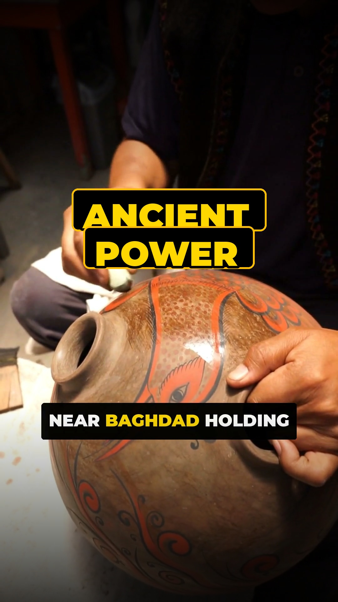 | 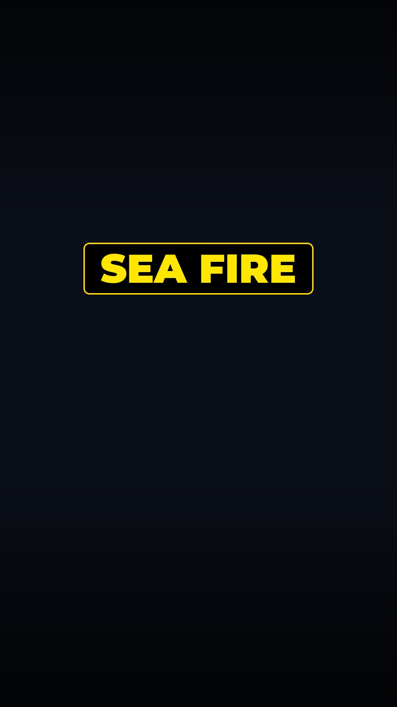 | 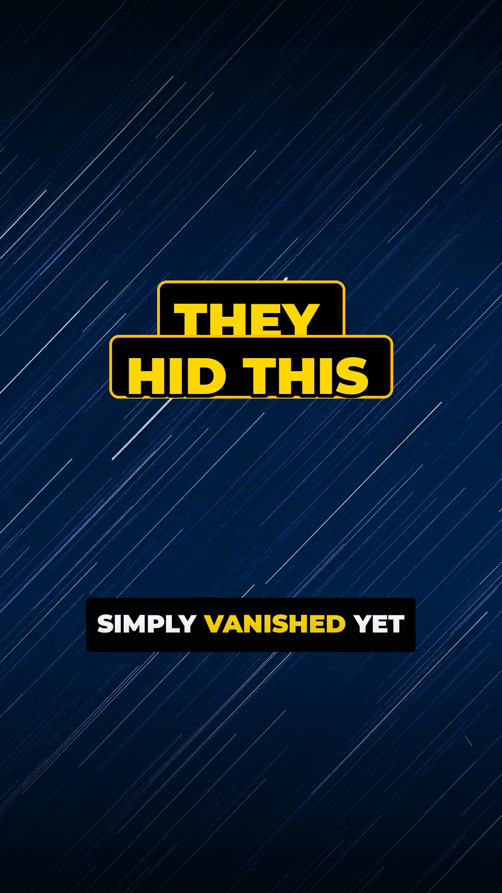 | 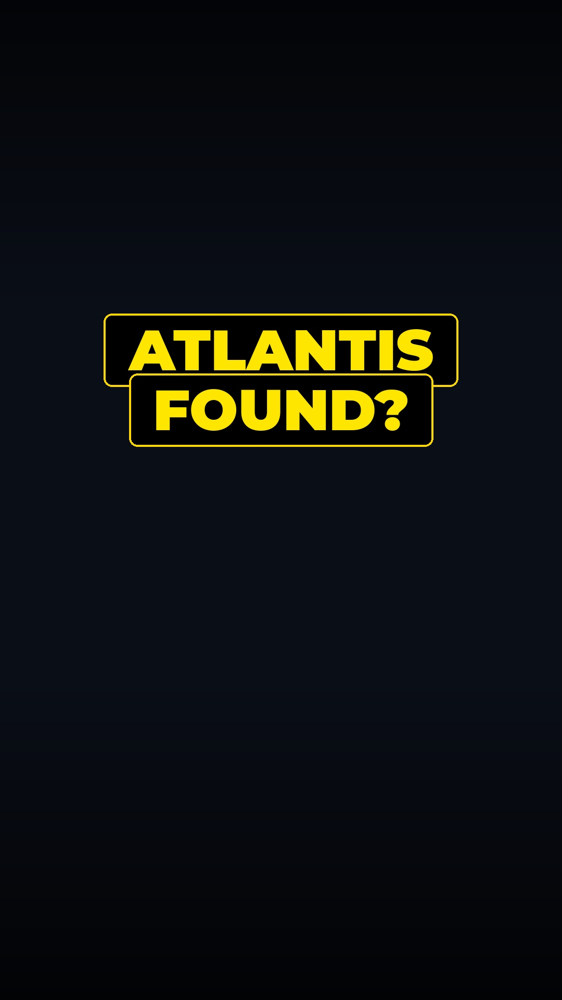 |
| **Duration**: 105s \| **Size**: 26 MB | **Duration**: 98s \| **Size**: 37 MB | **Duration**: 58s \| **Size**: 44 MB | **Duration**: 55s \| **Size**: 35 MB |

#### 💻 Tech & Cyber Espionage (`profiles/tech.toml`)
| Ep 1: CIA Secret 1984 Silicon Chip Fab | Ep 2: Quantum Supremacy Encryption |
| :---: | :---: |
| 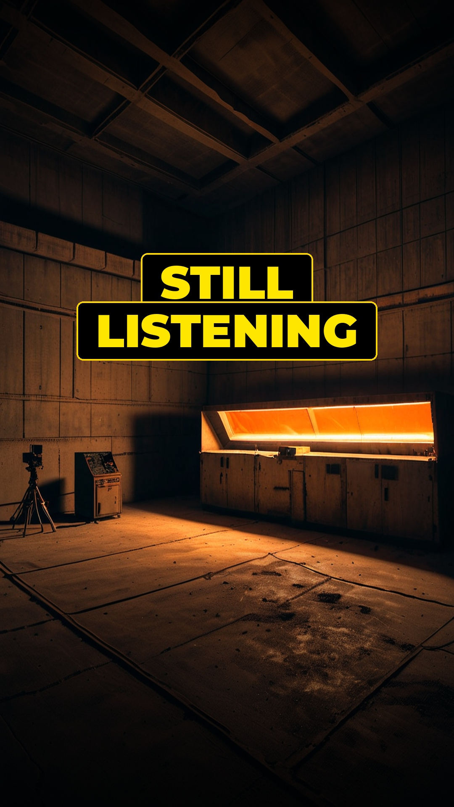 | 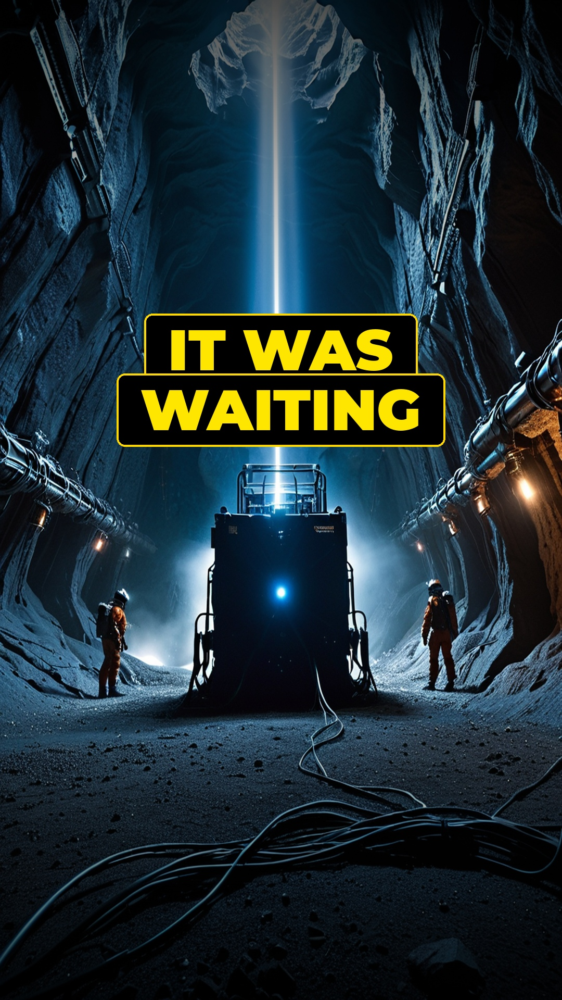 |
| **Duration**: 94s \| **Size**: 22 MB | **Duration**: 108s \| **Size**: 50 MB |

---

## 🏗️ System Architecture

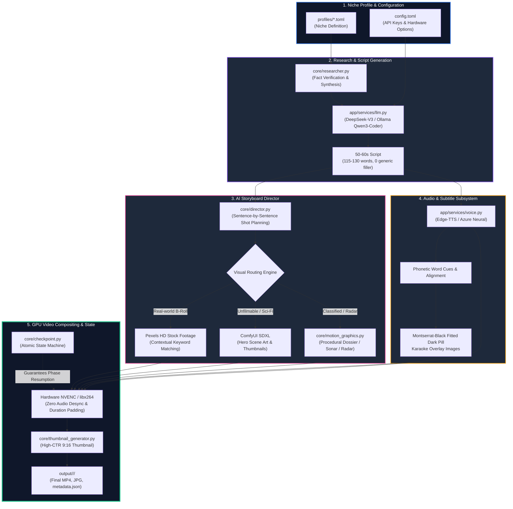

---

## 🔬 Deep-Dive Subsystems

### 1. Unified LLM Architecture & Flexible Director Engine
The engine is fully model-agnostic and does not force you to run heavy local models:
1. **Primary Cloud LLM (Recommended)**: The Movie Director executes on the **exact same model** you configure for scriptwriting (`deepseek-chat`, `gpt-4o`, `claude-3-5-sonnet`, etc.). If you use cloud APIs, **zero local LLM or Ollama setup is required**.
2. **Optional Local Fallback (Ollama)**: If you prefer running 100% offline or air-gapped, local Ollama (`qwen3:8b`) is fully supported as an automated fail-safe.
3. **Sequential GPU Handshake**:
   - When running local Ollama, the director runs shot planning in VRAM.
   - The pipeline immediately issues a `{"model": "qwen3:8b", "keep_alive": 0}` request to flush weights from GPU memory.
   - ComfyUI SDXL is then triggered into the vacated VRAM, followed by hardware NVENC encoding.

### 2. Intelligent Visual Routing & Fallback Matrix
Every script segment is evaluated by the director and assigned to the most effective visual pipeline:
* **Stock Footage (Pexels / Pixabay)**: For historical, urban, marine, or archival settings. Automatically deduplicates queries and filters against niche-specific negative keywords (e.g., banning food, cooking, beaches, cartoons).
* **AI Generative (ComfyUI SDXL)**: For unfilmable scenarios (e.g., Earth stopping rotation, Hadal zone leviathans, Dyatlov pass anomalies). Runs Ken Burns pan-and-scan camera interpolation.
* **Procedural Python Animations (`core/motion_graphics.py`)**:
  - **Classified Redacted Dossier**: Dynamically sweeps a black forensic marker across declassified government documents.
  - **Acoustic Sonar / Radar Pulse**: Animates a rotating 360° detection beam with range rings, pulsing targets, and telemetry overlays.
  - **Target Crosshairs**: Mathematical pinpointing of latitude/longitude coordinates.

### 3. Word-Synchronized Fitted Pill Karaoke Subtitles
Standard subtitle burn-in often obscures background action or produces awkward line wraps. Cinema Engine uses:
* **Dynamic Bounding Box Calculation**: Text width and height are measured per word using PIL font metrics.
* **Fitted Dark Pill Backgrounds**: Renders a dark, rounded capsule behind each subtitle phrase to ensure 100% contrast over complex backgrounds.
* **Real-Time Word Highlighting**: Colorizes active words using phonetic millisecond timestamps returned by Edge-TTS or Azure Speech.

### 4. Crash-Proof State Machine (`core/checkpoint.py`)
Long-running batch generation is resilient to interruptions, reboots, or network blips:
```
[start] → [script_generated] → [audio_generated] → [materials_ready] → [video_rendered] → [completed]
```
Checkpoints are written atomically (`.tmp` file replaced via `os.replace`). If execution halts at stage 4, re-running the command immediately resumes from stage 4 without re-billing LLM or TTS calls.

### 5. Seamless Hardware NVENC with CPU Fallback
FFmpeg encoding tries hardware-accelerated NVIDIA NVENC (`h264_nvenc -preset p4 -tune hq`) first. If CUDA drivers or NVENC sessions are busy or unsupported, it automatically falls back to CPU `libx264 -preset ultrafast`, ensuring zero broken jobs on headless or non-GPU nodes.

---

## 📂 Niche Profiles Catalogue

The engine comes pre-configured with **14 production-grade niche profiles** in `profiles/`:

| Profile File | Niche Topic | Arc Title | Voice & Pacing | Visual Style Tokens |
| :--- | :--- | :--- | :--- | :--- |
| `what_if.toml` | What If & Catastrophes | Cataclysmic Hypotheticals: Earth, Physics & The Universe | ChristopherNeural (1.12x) | Epic planetary scales, apocalyptic CGI, cosmic physics |
| `space_anomalies.toml` | Deep Space Mysteries | Unexplained Signals & Cosmic Anomalies | ChristopherNeural (1.10x) | Deep space telescope, radio telescopes, cosmic void |
| `prehistoric.toml` | Prehistoric Earth | Primordial Monsters & Extinction Events | ChristopherNeural (1.12x) | Prehistoric jungles, giant reptiles, fossil excavations |
| `military_black_ops.toml` | Military Black Ops | Top Secret Weapons & Cold War Programs | ChristopherNeural (1.12x) | Skunkworks blueprints, radar scopes, redacted files |
| `forbidden_archaeology.toml` | Forbidden Archaeology | Impossible Megaliths & Ancient Technologies | ChristopherNeural (1.12x) | Megalithic masonry, subterranean tunnels, LIDAR scans |
| `unsolved_mysteries.toml` | Chilling Cold Cases | Historical Anomalies & Vanishing Phenomena | ChristopherNeural (1.12x) | Foggy wilderness, archival evidence, vintage logs |
| `deep_sea.toml` | Deep Sea Horrors | Abyssal Trench Anomalies & Lost Submersibles | ChristopherNeural (1.10x) | Bathypelagic zone, sonar telemetry, abyssal bioluminescence |
| `money_heists.toml` | World's Greatest Heists | The Perfect Crimes: Safe Cracking & Vault Breaches | ChristopherNeural (1.10x) | Bank vaults, security laser schematics, diamond quarters |
| `true_crime.toml` | True Crime Mysteries | Chilling Cold Cases & Vanished Enigmas | ChristopherNeural (1.10x) | Crime scene evidence, police reports, archival photographs |
| `psychology.toml` | Dark Psychology | Forbidden Experiments & Psychological Mind Control | ChristopherNeural (1.10x) | Vintage psychiatric laboratories, surveillance monitors |
| `ancient.toml` | Ancient High Tech | Lost Engineering & Out-Of-Place Artifacts | ChristopherNeural (1.10x) | Weathered bronze gears, temple relief carvings, papyrus |
| `mythology.toml` | Cataclysmic Mythology | Cataclysms, Lost Civilizations & Planetary Deluges | ChristopherNeural (1.10x) | Volcanic ash clouds, tidal waves, ancient monoliths |
| `tech.toml` | Tech & Cyber Espionage | Silicon Vaults, Quantum Encryption & Submarine Cables | ChristopherNeural (1.10x) | Cleanrooms, silicon wafers, fiber optic underwater maps |
| `dark_history.toml` | Dark History | Suppressed Historical Coverups | ChristopherNeural (1.10x) | Declassified documents, antique photographs |

---

## 💻 System Requirements

| Specification | Minimum | Recommended |
| :--- | :--- | :--- |
| **Operating System** | Linux (Ubuntu 22.04+, Debian, Arch) / Windows WSL2 | Linux (Ubuntu 24.04 LTS / Arch Linux) |
| **CPU** | 4-Core x86_64 CPU | 8-Core modern CPU |
| **System RAM** | 16 GB | 32 GB |
| **GPU** | NVIDIA GPU with 8 GB VRAM (RTX 2060/2070) | NVIDIA GPU with 12+ GB VRAM (RTX 3060/4070+) |
| **Disk Space** | 20 GB free space | 100+ GB SSD (for SDXL checkpoints and caching) |
| **FFmpeg** | FFmpeg 5.x+ (with `h264_nvenc` support) | FFmpeg 7.x+ (with NVENC + libwebp) |
| **Python** | Python 3.11+ | Python 3.11 or 3.12 |

---

## 🚀 Installation & Setup

### 1-Click Automated Setup
The interactive installer verifies tools, offers optional offline Ollama configuration, builds the virtual environment, and links CLI commands:

```bash
git clone https://github.com/Joshualeexy/moneyprinter-studio.git
cd moneyprinter-studio
chmod +x install.sh
./install.sh
```

*(Pass `-y` or `--yes` for non-interactive / headless CI/CD execution).*

---

### Manual Installation Step-by-Step

#### 1. System Dependencies
```bash
# Ubuntu / Debian
sudo apt-get update && sudo apt-get install -y ffmpeg curl git python3 python3-venv python3-pip

# Arch Linux
sudo pacman -S --noconfirm ffmpeg curl git python
```

#### 2. AI Director & Scriptwriter (Cloud API or Local Ollama)
The AI Director is **not limited or forced to run local models** — it uses the **exact same LLM backend** as your scriptwriter (`deepseek-chat`, `gpt-4o`, `claude-3-5-sonnet`, etc.).

* **Cloud API (Recommended)**: If using DeepSeek, OpenAI, Claude, or any OpenAI-compatible provider, **skip this step entirely** (no local LLM or Ollama setup is needed).
* **Local Offline Engine (Optional)**: If running 100% offline or air-gapped without API costs:
```bash
curl -fsSL https://ollama.com/install.sh | sh
ollama serve &
ollama pull qwen3:8b
```

#### 3. Python Virtual Environment
```bash
python3 -m venv .venv
source .venv/bin/activate
pip install --upgrade pip
pip install -r requirements.txt
```

#### 4. Configure Application Keys
```bash
cp config.example.toml config.toml
```
Open `config.toml` and configure your keys (see next section).

---

## ⚙️ Configuration Reference

Configuration is managed via `config.toml` (ignored by git to protect credentials):

```toml
log_level = "DEBUG"
listen_host = "0.0.0.0"
listen_port = 8080

[app]
# 1. Unified Scriptwriter & Movie Director (Cloud API or Local)
# Both script generation and director storyboard shot planning run seamlessly
# through your configured LLM provider (DeepSeek, OpenAI, Gemini, Ollama, etc.):
llm_provider = "deepseek"
deepseek_api_key = "sk-your-deepseek-api-key"
deepseek_base_url = "https://api.deepseek.com"
deepseek_model_name = "deepseek-chat"

# Optional: Local Ollama fallback (only used if offline or if cloud API is unreachable)
ollama_base_url = "http://127.0.0.1:11434/v1"
ollama_model_name = "qwen3:8b"

# 2. Stock Footage Providers (Free API key at pexels.com/api)
video_source = "pexels"
pexels_api_keys = ["YOUR_PEXELS_API_KEY"]

# 3. ComfyUI SDXL Hero Scene Art (Optional - for unfilmable scenes)
comfyui_url = "http://127.0.0.1:8188"
sdxl_checkpoint = "juggernautXL_ragnarok.safetensors"

# 4. Hardware Video Encoding
video_codec = "libx264"
enable_nvenc = true
```

---

## 🎬 CLI Reference

Run the engine via `./run_worker.sh` (or the globally installed `moneyprinter-studio` command):

### 1. Launch a Multi-Episode Series Arc
Generates consecutive episodes for a niche, tracking topics and numbering sequentially:
```bash
# Generate 5 episodes for What If Catastrophes:
./run_worker.sh series what_if 5

# Generate 5 episodes for Prehistoric Earth:
./run_worker.sh series prehistoric 5

# Generate 5 episodes for Military Black Ops:
./run_worker.sh series military_black_ops 5

# Generate 5 episodes for Space Anomalies:
./run_worker.sh series space_anomalies 5
```

### 2. Run Single Episode on Specific Subject
```bash
python worker.py --profile what_if --topic "What If Earth Had Saturn's Rings?"
```

### 3. Check Rendered Videos & Active Checkpoints
```bash
./run_worker.sh status
```

### 4. List All Available Niche Profiles
```bash
./run_worker.sh profiles
```

### 5. Clear Stalled Checkpoint for a Niche
```bash
./run_worker.sh clear what_if
```

---

## 🔄 Production Deployment & 24/7 Daemon

### Running the Autonomous Infinite Generator
To operate the engine continuously across all 14 niches in a round-robin schedule:
```bash
# Starts continuous generation with auto VRAM flushes between cycles
./run_worker.sh infinite
```

### Background Daemon via `systemd` (Linux Production)
Create `/etc/systemd/system/moneyprinter-studio.service`:
```ini
[Unit]
Description=MoneyPrinter Studio 24/7 Generator
After=network.target

[Service]
Type=simple
User=kodar
WorkingDirectory=/home/kodar/face
ExecStart=/home/kodar/face/run_worker.sh infinite
Restart=always
RestartSec=15
StandardOutput=journal
StandardError=journal

[Install]
WantedBy=multi-user.target
```

Enable and start the service:
```bash
sudo systemctl daemon-reload
sudo systemctl enable moneyprinter-studio
sudo systemctl start moneyprinter-studio
sudo journalctl -u moneyprinter-studio -f
```

---

## 📁 Output Directory Hierarchy

Every completed video is archived into a self-contained folder under `output/<niche_slug>/<episode_folder>/`:

```
output/
└── what_if/
    └── 01_what_if_earth_stopped_spinning_for_five_secon/
        ├── 01_what_if_earth_stopped_spinning_for_five_secon.mp4  # 1080x1920 30fps Final Render
        ├── thumbnail.jpg                                        # 9:16 High-CTR Thumbnail
        └── metadata.json                                        # Production Telemetry & Tags
```

### Example `metadata.json`:
```json
{
  "topic": "What If Earth Stopped Spinning for Five Seconds?",
  "niche": "what_if",
  "episode": 1,
  "duration_seconds": 52.6,
  "file_size_mb": 14.2,
  "resolution": "1080x1920",
  "file_path": "output/what_if/01_what_if_earth_stopped_spinning_for_five_secon/01_what_if_earth_stopped_spinning_for_five_secon.mp4",
  "thumbnail_file": "output/what_if/01_what_if_earth_stopped_spinning_for_five_secon/thumbnail.jpg"
}
```

---

## 🛠️ Troubleshooting

| Issue | Root Cause | Solution |
| :--- | :--- | :--- |
| `NVENC render failed` | GPU encoder session full or driver mismatch | MoneyPrinter Studio automatically falls back to CPU `libx264`. To re-enable NVENC, check `nvidia-smi` and ensure FFmpeg has `--enable-nvenc`. |
| `CUDA out of memory (OOM)` | Ollama and ComfyUI loaded in GPU simultaneously | Ensure director offload is enabled. MoneyPrinter Studio automatically calls `keep_alive: 0` on Ollama before ComfyUI launches. |
| `Pexels 429 Too Many Requests` | API hourly rate limit reached | Add multiple Pexels keys to `pexels_api_keys = ["key1", "key2"]` in `config.toml` for automatic rotation. |
| `Edge-TTS Connection Reset` | Upstream Microsoft speech endpoint rate limit | The worker automatically retries TTS calls. If persistent, increase `edge_tts_timeout = 60` in `config.toml`. |
| `Black frames at end of video` | Video duration shorter than speech duration | MoneyPrinter Studio's duration padding automatically loops and pads video clips to match 100% of the speech stream. |

---

## 🤝 Contributing

Contributions are welcome! Please feel free to open PRs for:
* Additional niche profiles in `profiles/`
* New procedural animation overlays in `core/motion_graphics.py`
* Generative video backend integrations (e.g. Wan2.1, HunyuanVideo)

---

## 📜 License

This project is licensed under the **MIT License** — see the [LICENSE](LICENSE) file for details.
