<div align="center">

# 🎬 Autonomous Niche Cinema Engine

### Configuration-driven AI documentary production pipeline for autonomous multi-niche video generation

**Research • LLM Scriptwriting • AI Shot Direction • SDXL • TTS • Karaoke Subtitles • NVENC • Durable Checkpoints**

[](https://www.python.org/)
[](LICENSE)
[](https://developer.nvidia.com/video-encode-decode-gpu-support-matrix)
[](https://ollama.com/)
[](https://github.com/comfyanonymous/ComfyUI)
[](#-requirements)

<p align="center">
  <a href="#-demo--showcase">Demo & Showcase</a> •
  <a href="#-architectural-comparison">Architectural Comparison</a> •
  <a href="#-key-systems--architecture">Key Systems</a> •
  <a href="#-requirements">Requirements</a> •
  <a href="#-1-click-installation">1-Click Install</a> •
  <a href="#-manual-installation-guide">Manual Setup</a> •
  <a href="#-configuration-reference">Configuration</a> •
  <a href="#-cli-quickstart">CLI Quickstart</a> •
  <a href="#-output-structure">Output Structure</a> •
  <a href="#-niche-profiles">Niche Profiles</a>
</p>

</div>

---

## 📽️ Demo & Showcase

A stateful, configuration-driven production pipeline that autonomously operates entire documentary content verticals: research, narrative script generation, shot planning, visual routing, audio synchronization, GPU compositing, high-contrast thumbnail rendering, and crash-resilient batch execution.

<div align="center">

| Generated Episode Demo (1080x1920) | Pipeline Execution Flow |
| :---: | :---: |
| 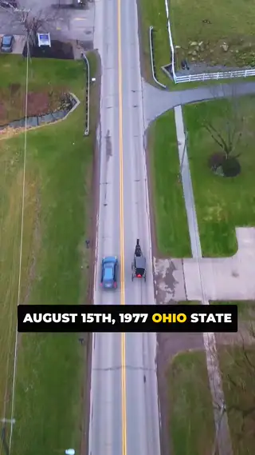 | `Research` <br/> ↓ <br/> `Scriptwriter (qwen3-coder:30b / DeepSeek-V3)` <br/> ↓ <br/> `Director (qwen3:8b)` <br/> ↓ <br/> `Visual Routing (Stock / SDXL / Motion)` <br/> ↓ <br/> `Narration & Word Cues (TTS)` <br/> ↓ <br/> `Pill Karaoke Subtitles` <br/> ↓ <br/> `NVENC Hardware Compositing` <br/> ↓ <br/> `Thumbnail Generation` <br/> ↓ <br/> `Output Archive` |

</div>

### Live Generated Series Samples

Below are real episodes and high-contrast thumbnails generated autonomously across active niche profiles:

#### 🌌 Space Anomalies (`profiles/space_anomalies.toml`)
| Ep 1: The 1977 Wow! Signal | Ep 2: The Mystery of Oumuamua | Ep 3: Tabby's Star Dyson Swarm | Ep 4: The Boötes Void |
| :---: | :---: | :---: | :---: |
| 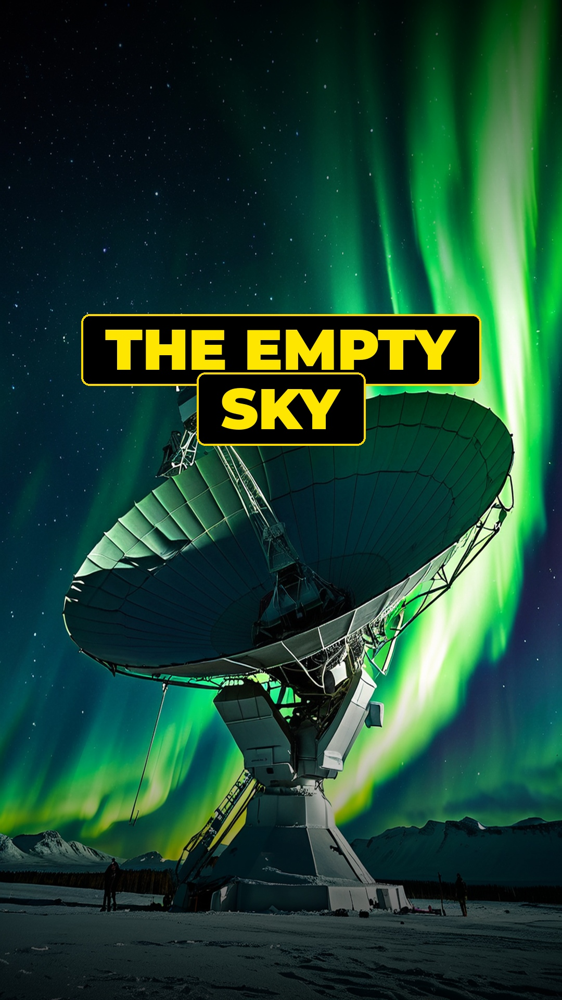 | 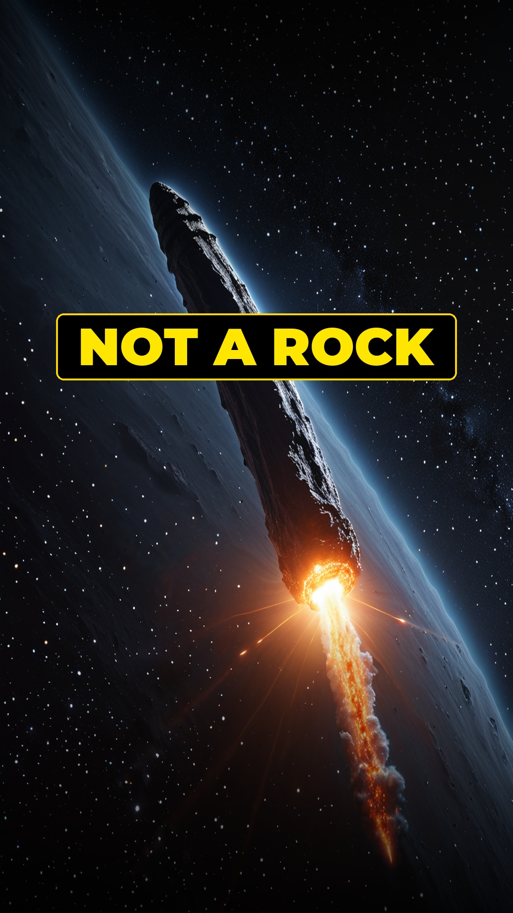 | 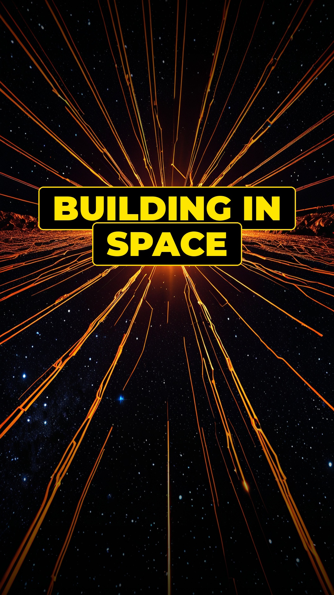 | 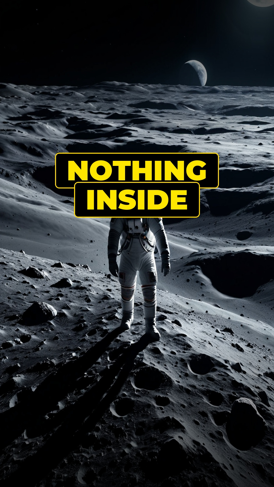 |
| **Duration**: 107s \| **Size**: 28.9 MB | **Duration**: 100s \| **Size**: 27.0 MB | **Duration**: 116s \| **Size**: 30.2 MB | **Duration**: 97s \| **Size**: 26.3 MB |

#### 🌊 Deep Sea Horrors (`profiles/deep_sea.toml`)
| Ep 1: The 1997 Bloop Signal | Ep 3: Point Nemo Graveyard | Ep 4: The Baltic Sea Monolith | Ep 5: Hadal Zone Gigantism |
| :---: | :---: | :---: | :---: |
| 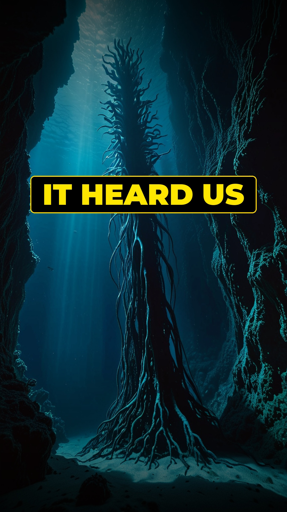 | 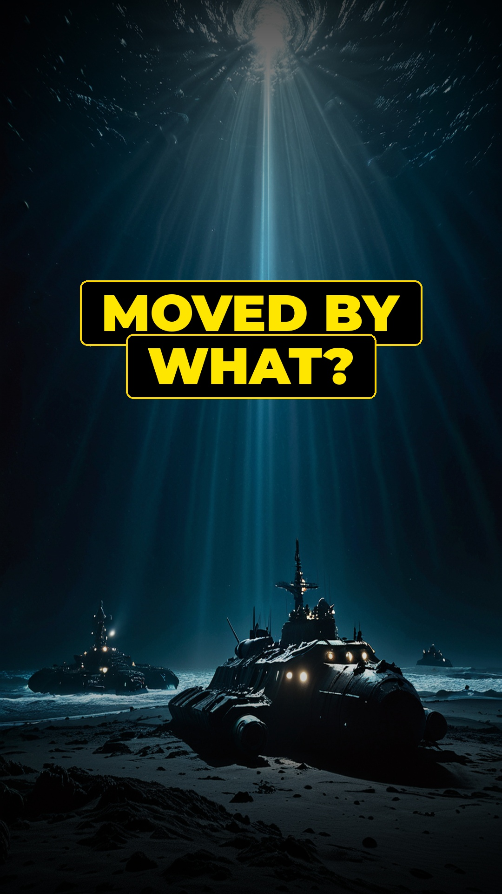 | 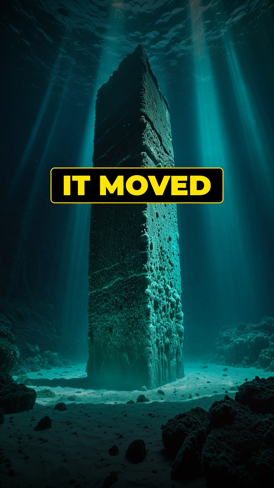 | 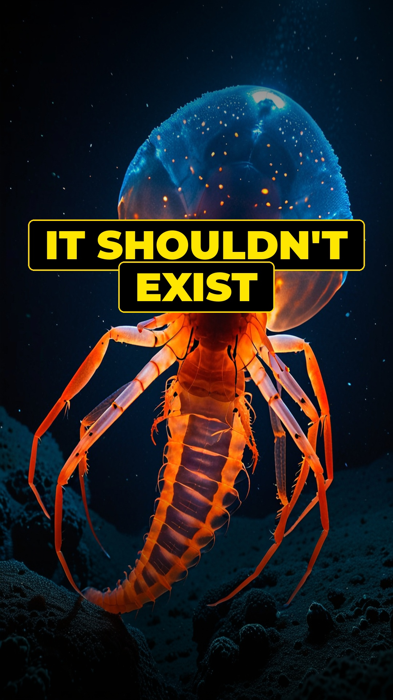 |
| **Duration**: 103s \| **Size**: 28.3 MB | **Duration**: 119s \| **Size**: 31.0 MB | **Duration**: 109s \| **Size**: 29.4 MB | **Duration**: 103s \| **Size**: 27.5 MB |

#### 🕵️ True Crime & Cold Cases (`profiles/true_crime.toml`)
| Ep 1: The Yuba County Five | Ep 2: The D.B. Cooper Skyjacking | Ep 4: The Hinterkaifeck Murders |
| :---: | :---: | :---: |
| 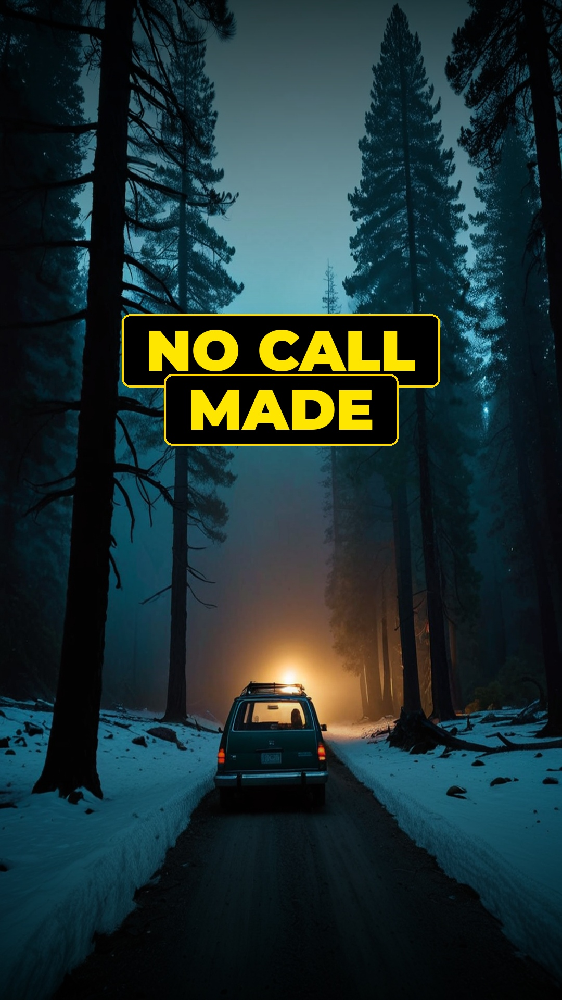 | 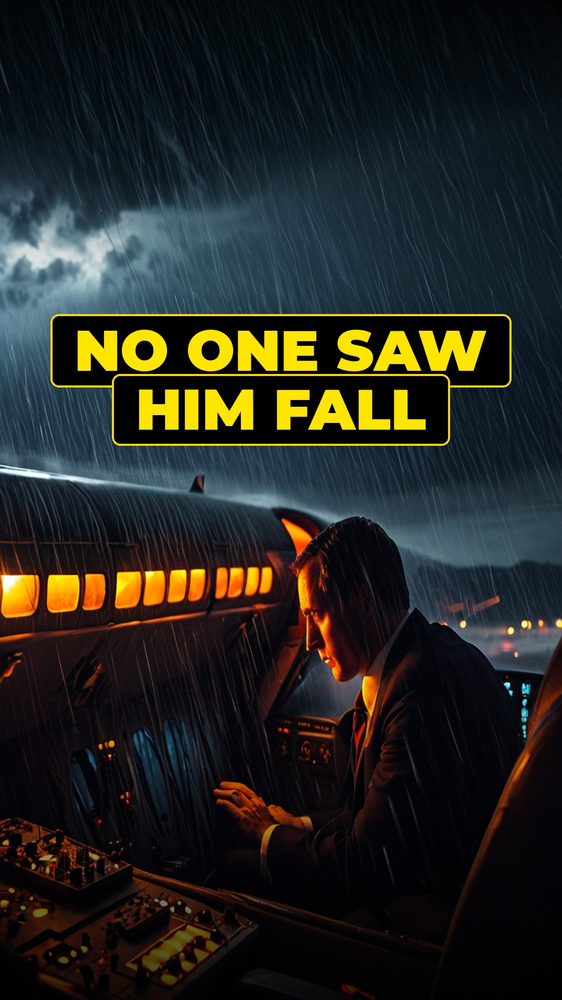 | 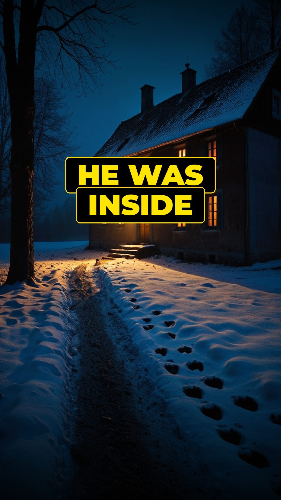 |
| **Duration**: 114s \| **Size**: 29.0 MB | **Duration**: 99s \| **Size**: 28.1 MB | **Duration**: 112s \| **Size**: 30.6 MB |

#### 💎 World's Greatest Heists (`profiles/money_heists.toml`)
| Ep 1: Antwerp Diamond Heist | Ep 2: Hatton Garden Vault Breach | Ep 4: Gardner Museum Art Heist |
| :---: | :---: | :---: |
| 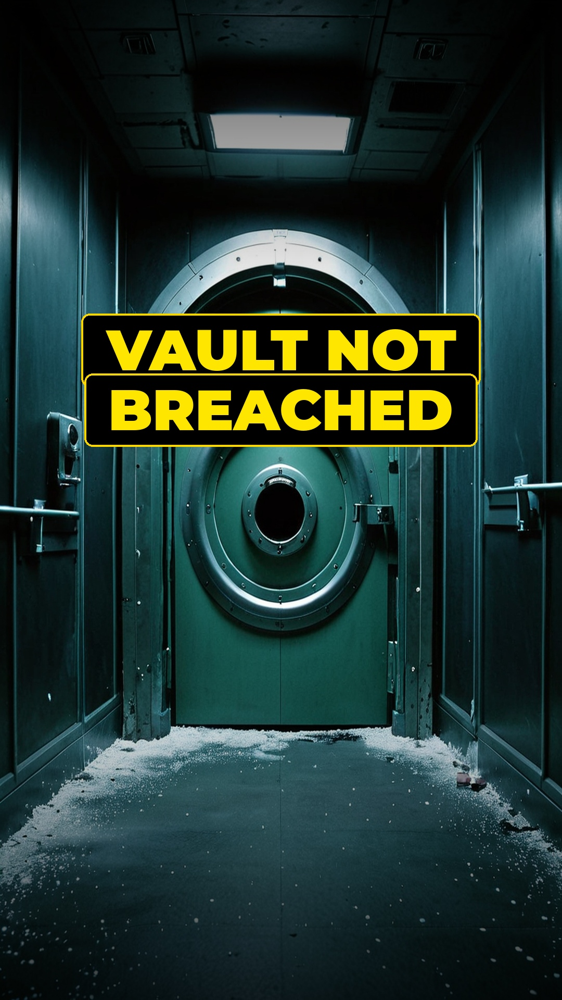 | 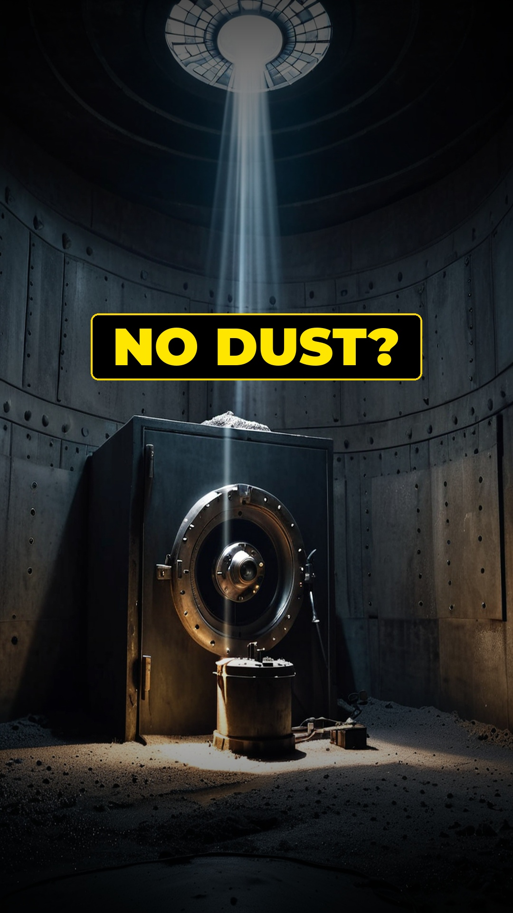 | 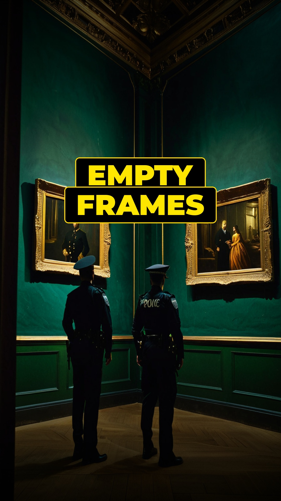 |
| **Duration**: 114s \| **Size**: 27.9 MB | **Duration**: 106s \| **Size**: 26.2 MB | **Duration**: 92s \| **Size**: 21.5 MB |

#### 🧠 Dark Psychology (`profiles/psychology.toml`)
| Ep 1: Project MK-Ultra Subproject 68 | Ep 2: The Monster Study | Ep 3: Stanford Prison Experiment |
| :---: | :---: | :---: |
| 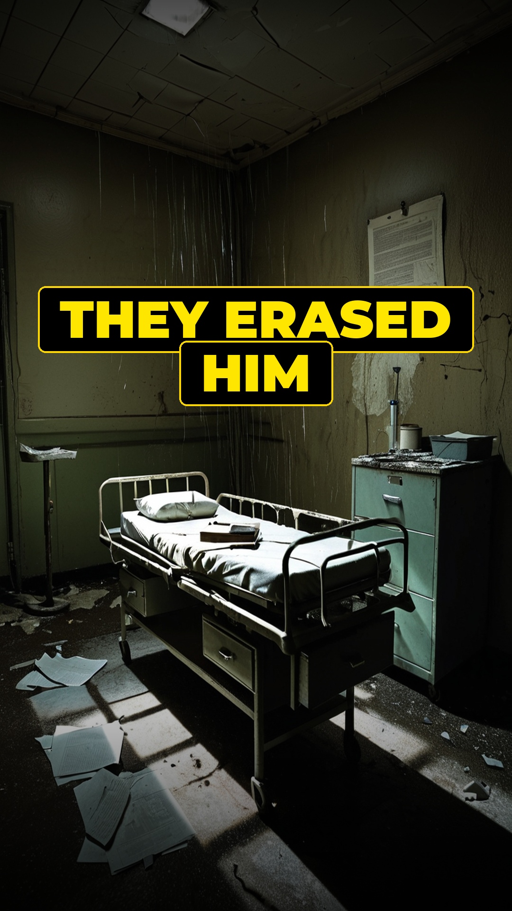 | 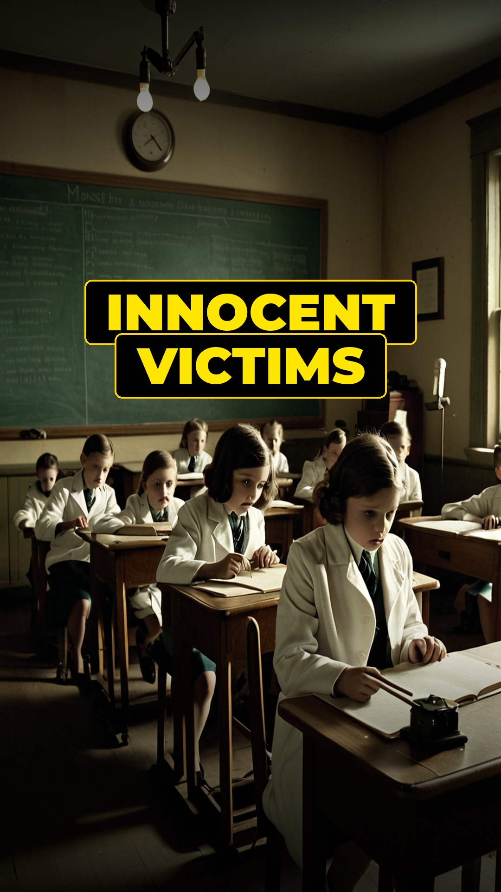 | 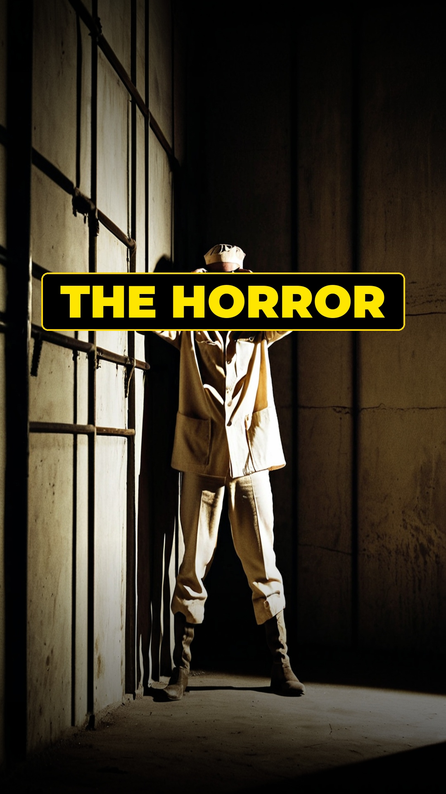 |
| **Duration**: 84s \| **Size**: 22.2 MB | **Duration**: 97s \| **Size**: 25.1 MB | **Duration**: 102s \| **Size**: 27.1 MB |

---

## ⚡ Architectural Comparison

MoneyPrinterTurbo (MPT) and Cinema Engine address short-video generation with fundamentally different design priorities:

| Dimension | MoneyPrinterTurbo (MPT) | Autonomous Cinema Engine |
| :--- | :--- | :--- |
| **Primary Goal** | General-purpose AI short-video generation | Automated niche documentary series production |
| **Workflow** | Topic → Script → Media → Video | Research → Script → Direction → Media Routing → Composition |
| **Series Memory** | General batch generation | Explicit episodic state tracking (`current_arc`, `episodes`) |
| **Visual Generation** | Stock & local media | Hybrid: Stock footage + ComfyUI SDXL + Procedural graphics |
| **Director Layer** | Keyword & media matching | Sentence-level shot planning (`qwen3:8b`) |
| **Thumbnails** | Standard video extraction | Dedicated high-contrast thumbnail generation |
| **Failure Recovery** | Application-dependent | Persistent pipeline checkpoints (`pipeline_state_<niche>.json`) |
| **GPU Strategy** | Optional GPU (CPU-first friendly) | GPU-aware local generation pipeline (NVENC + SDXL) |

### Scaling Batch Production
Long-running media generation workers encounter specific scaling challenges when individual tasks are not isolated or explicitly managed:
* **API Rate Limits**: Standard per-sentence queries can quickly exceed external stock API quotas. Cinema Engine implements local asset caching, query deduplication, and routes unfilmable or rate-limited scenes to local ComfyUI SDXL generation.
* **Visual Repetition**: Keyword matching without contextual filtering often returns repetitive or irrelevant stock footage. Cinema Engine pairs an LLM director with per-niche negative keyword filters.
* **Resource Leaks**: Video processing pipelines in long Python loops can accumulate memory and unclosed file descriptors. Cinema Engine executes generation in isolated worker subprocesses and triggers explicit garbage collection and VRAM flushes between tasks.
* **Narrative Continuity**: Standalone generation lacks awareness of previously produced content. Cinema Engine tracks topic metadata across output directories to ensure distinct subjects within every narrative arc.

---

## 🏗️ Key Systems & Architecture

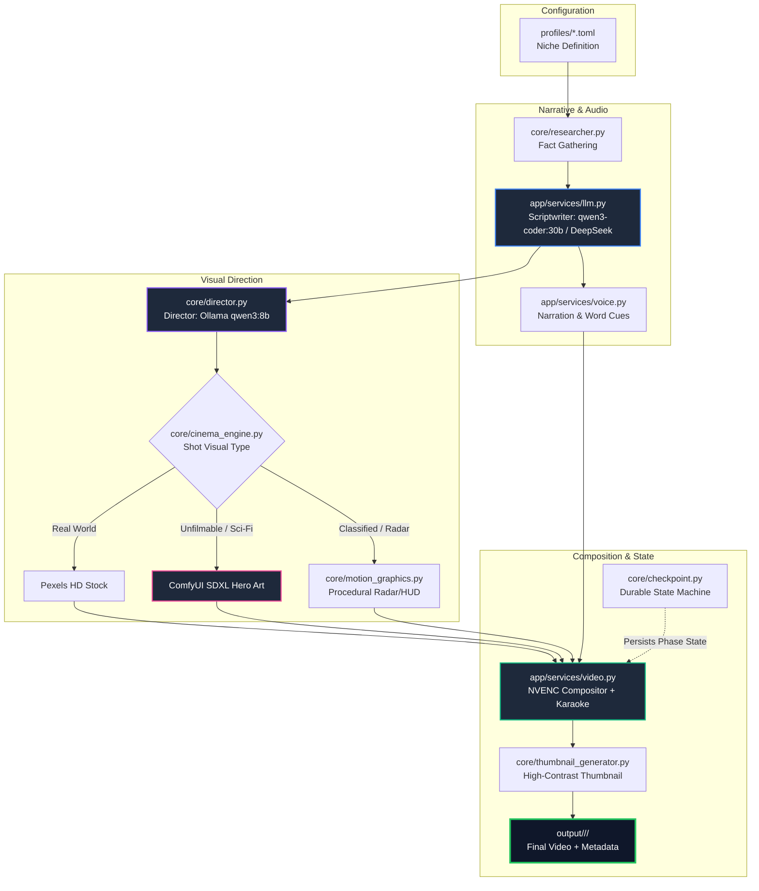
```mermaid
flowchart TD
    subgraph Configuration
        P[profiles/*.toml\nNiche Definition]
    end

    subgraph Narrative & Audio
        R[core/researcher.py\nFact Gathering]
        S[app/services/llm.py\nScriptwriter: qwen3-coder:30b / DeepSeek]
        V[app/services/voice.py\nNarration & Word Cues]
    end

    subgraph Visual Direction
        D[core/director.py\nDirector: Ollama qwen3:8b]
        ROUTER{core/cinema_engine.py\nShot Visual Type}
        STK[Pexels HD Stock]
        SDXL[ComfyUI SDXL Hero Art]
        MOG[core/motion_graphics.py\nProcedural Radar/HUD]
    end

    subgraph Composition & State
        COMP[app/services/video.py\nNVENC Compositor + Karaoke]
        THUMB[core/thumbnail_generator.py\nHigh-Contrast Thumbnail]
        CHK[core/checkpoint.py\nDurable State Machine]
        OUT[output/<niche>/<episode>/\nFinal Video + Metadata]
    end

    P --> R --> S --> V
    S --> D --> ROUTER
    ROUTER -->|Real World| STK --> COMP
    ROUTER -->|Unfilmable / Sci-Fi| SDXL --> COMP
    ROUTER -->|Classified / Radar| MOG --> COMP
    V --> COMP
    COMP --> THUMB --> OUT
    CHK -.->|Persists Phase State| COMP

    style S fill:#1e293b,stroke:#3b82f6,stroke-width:2px,color:#fff
    style D fill:#1e293b,stroke:#8b5cf6,stroke-width:2px,color:#fff
    style SDXL fill:#1e293b,stroke:#ec4899,stroke-width:2px,color:#fff
    style COMP fill:#1e293b,stroke:#10b981,stroke-width:2px,color:#fff
    style OUT fill:#0f172a,stroke:#22c55e,stroke-width:3px,color:#fff
```

### 1. VRAM-Aware Model Handoff
To operate a local LLM director and local ComfyUI SDXL inference concurrently on an 8GB VRAM consumer GPU (e.g. RTX 2070 Max-Q):
1. The Director (`qwen3:8b`) loads into VRAM and produces the frame-by-frame shot plan.
2. The pipeline explicitly calls Ollama with `keep_alive: 0`, releasing the director's model allocation before ComfyUI starts.
3. ComfyUI loads the SDXL checkpoint using `--lowvram` into the vacated GPU memory to render scene assets.
4. Video compositing executes via hardware NVENC (`h264_nvenc`) with minimal memory overhead.

### 2. Durable Pipeline State Machine
Every generation task is backed by an atomic checkpoint manager (`core/checkpoint.py`). If the process is interrupted or the machine reboots, execution resumes from the last completed phase without repeating finished compute:

```
start → script_generated → audio_generated → subtitle_generated → materials_ready → video_rendered → completed
```

### 3. Word-Aligned Fitted Pill Karaoke Subtitles
Subtitle rendering dynamically measures rendered text widths against screen bounds, generates rounded dark pill background patches behind active phrases, and highlights current words in real-time based on phonetic timestamps from Edge-TTS or Azure Speech.

### 4. Procedural Python Animation & 2.5D Camera Motion
When scenes require technical, forensic, or classified visual representations, the pipeline executes pure-Python procedural animations rather than generic stock:
* **Procedural Motion Graphics Engine (`core/motion_graphics.py`)**: Uses Pillow (`PIL`) and mathematical easing curves to render frame-by-frame standalone video assets:
  * **Classified Redacted Dossier**: Dynamically sweeps a black forensic highlighter across classified document lines.
  * **Radar & Sonar Sweep**: Animates a rotating 360° detection sweep with pulsing concentric range rings and glowing target blips.
  * **Vintage Map Location Ping**: Renders animated crosshairs locking onto coordinates with expanding shockwave pings.
* **2.5D Ken Burns Camera Engine (`core/motion.py`)**: Converts static ComfyUI SDXL renders into fluid 1080x1920 30fps video clips with hardware-accelerated pan-and-scan camera movements (slow dramatic push-in, pull-out scene reveals, and macro vertical pans).

---

## 💻 Requirements

| Component | Minimum | Recommended |
| :--- | :--- | :--- |
| **OS** | Linux (Ubuntu 20.04+, Arch, Debian) or Windows WSL2 | Linux (Ubuntu 22.04+ / Arch Linux) |
| **CPU** | 4-Core x86_64 CPU | 8-Core modern CPU |
| **System RAM** | 16 GB RAM | 32 GB RAM |
| **GPU** | NVIDIA GPU with 8 GB VRAM (RTX 2060/2070) | NVIDIA GPU with 12+ GB VRAM (RTX 3060/4070+) |
| **Storage** | 20 GB free disk space | 100+ GB SSD (for SDXL checkpoints & video cache) |
| **Software** | Python 3.10+, FFmpeg with NVENC support | Python 3.11+, FFmpeg (NVENC enabled), Ollama |

> [!NOTE]
> CPU-only execution is supported for the scriptwriting, audio, stock footage, and subtitle composition phases. However, local ComfyUI SDXL image generation and hardware-accelerated encoding require a compatible NVIDIA GPU with CUDA and NVENC drivers.

---

## 🚀 1-Click Installation

The automated setup script validates prerequisites, installs missing packages, configures Ollama, downloads director models, creates the Python environment, and links global CLI commands:

```bash
git clone https://github.com/yourusername/cinema-engine.git
cd cinema-engine
chmod +x install.sh

# Run interactive installer
./install.sh
```

### Installer Options:
* `-y, --yes`: Run non-interactively using default settings (ideal for headless servers or Docker builds).
* `-h, --help`: Display usage and options.

---

## 🛠️ Manual Installation Guide

For manual setup on supported platforms:

### 1. Install System Dependencies
* **Ubuntu / Debian**:
  ```bash
  sudo apt-get update && sudo apt-get install -y ffmpeg curl git python3 python3-venv python3-pip
  ```
* **Arch Linux / Manjaro**:
  ```bash
  sudo pacman -S --noconfirm ffmpeg curl git python
  ```
* **Fedora / RHEL**:
  ```bash
  sudo dnf install -y ffmpeg curl git python3 python3-devel
  ```

### 2. Install & Configure Ollama (Local AI Director)
```bash
curl -fsSL https://ollama.com/install.sh | sh
ollama serve &
ollama pull qwen3:8b
```

### 3. Setup ComfyUI SDXL (Optional for AI Hero Art)
```bash
mkdir -p ~/comfyui
git clone https://github.com/comfyanonymous/ComfyUI.git ~/comfyui/ComfyUI
cd ~/comfyui/ComfyUI
python3 -m venv venv
./venv/bin/pip install torch torchvision --index-url https://download.pytorch.org/whl/cu121
./venv/bin/pip install -r requirements.txt

# Place your SDXL checkpoint (e.g. juggernautXL_ragnarok.safetensors) into:
# ~/comfyui/ComfyUI/models/checkpoints/
```

### 4. Setup Python Environment
```bash
cd /path/to/cinema-engine
python3 -m venv .venv
source .venv/bin/activate
pip install --upgrade pip
pip install -r requirements.txt
```

### 5. Setup Configuration
```bash
cp config.example.toml config.toml
```

---

## ⚙️ Configuration Reference

Key settings in `config.toml`:

| Setting | Description | Default / Example | Required |
| :--- | :--- | :--- | :--- |
| `deepseek_api_key` | DeepSeek API key for scriptwriting | `"sk-..."` | Optional (if using Ollama) |
| `openai_api_key` | OpenAI API key for scriptwriting | `"sk-..."` | Optional |
| `ollama_model_name` | Ollama model for local scriptwriting | `"qwen3-coder:30b"` | Optional |
| `director_model` | Lightweight local model for shot planning | `"qwen3:8b"` | Yes |
| `pexels_api_keys` | List of Pexels API keys (supports rotation) | `["YOUR_PEXELS_KEY"]` | Recommended |
| `comfyui_url` | ComfyUI HTTP endpoint | `"http://127.0.0.1:8188"` | Yes (for SDXL) |
| `sdxl_checkpoint` | Checkpoint name in ComfyUI checkpoints dir | `"juggernautXL_ragnarok.safetensors"` | Yes (for SDXL) |
| `enable_nvenc` | Hardware-accelerated GPU video encoding | `true` | Recommended |

### Provider Architecture
The pipeline decouples service providers from core orchestration:
* **Scriptwriter**: DeepSeek-V3, OpenAI, or local `qwen3-coder:30b` (Qwen3-Coder 30B; 30.5B total parameters, 3.3B activated)
* **AI Director**: Ollama (`qwen3:8b` or `qwen2.5:7b`)
* **Voice & Subtitles**: Edge-TTS (default cloud-free) or Azure Cognitive Speech
* **Hero Visuals**: ComfyUI (SDXL)
* **B-Roll Footage**: Pexels, Pixabay, or local clip libraries

---

## 🎬 CLI Quickstart

Manage the engine using `./run_worker.sh` (or the globally linked `cinema-engine` command):

### Generate a Multi-Episode Series
Generates sequential episodes for a specific niche with chronological numbering, metadata, and thumbnails:
```bash
./run_worker.sh series prehistoric 5        # Primordial beasts & mass extinctions
./run_worker.sh series space_anomalies 5    # Deep space anomalies
./run_worker.sh series true_crime 5         # Unsolved cold cases
./run_worker.sh series money_heists 5       # World's greatest heists
./run_worker.sh series psychology 5         # Dark psychology experiments
```

### Run the 24/7 Autonomous Daemon
Continuously cycles through all configured niche profiles, creating new episodes and auto-progressing through content arcs:
```bash
./run_worker.sh infinite
```

### Check Worker Status & Generated Video Count
```bash
./run_worker.sh status
```

### List Available Niche Profiles
```bash
./run_worker.sh profiles
```

---

## 📁 Output Structure

Completed videos are saved under `output/<niche_slug>/<episode_slug>/`:

```
output/
└── space_anomalies/
    └── 01_the_1977_wow_signal_the_72_second_deep_space_/
        ├── 01_the_1977_wow_signal_the_72_second_deep_space_.mp4  # Final 1080x1920 MP4
        ├── thumbnail.jpg                                        # High-contrast 9:16 thumbnail
        └── metadata.json                                        # Runtime & topic metadata
```

### Example `metadata.json`:
```json
{
  "topic": "The 1977 Wow! Signal: The 72-Second Deep Space Mystery",
  "niche": "space_anomalies",
  "episode": 1,
  "duration_seconds": 107.2,
  "resolution": "1080x1920",
  "file_path": "output/space_anomalies/01_the_1977_wow_signal_the_72_second_deep_space_/01_the_1977_wow_signal_the_72_second_deep_space_.mp4",
  "thumbnail_file": "output/space_anomalies/01_the_1977_wow_signal_the_72_second_deep_space_/thumbnail.jpg"
}
```

---

## 📂 Niche Profiles

Niches are configured as modular TOML files in `profiles/`:

* 🦖 **`prehistoric.toml`**: Titanoboa, Permian Extinction, Megalodon vs Livyatan, Dunkleosteus, Carboniferous Giants.
* 🌌 **`space_anomalies.toml`**: Wow! Signal, Oumuamua, Tabby's Star, Boötes Void, Fast Radio Bursts.
* 🌊 **`deep_sea.toml`**: 1997 Bloop, Point Nemo Graveyard, Baltic Sea Monolith, Hadal Zone Gigantism.
* 🕵️ **`true_crime.toml`**: Yuba County Five, D.B. Cooper Skyjacking, Somerton Man, Hinterkaifeck.
* 💎 **`money_heists.toml`**: Antwerp Diamond Heist, Hatton Garden Safe Deposit, Banco Central Fortaleza.
* 🧠 **`psychology.toml`**: Project MK-Ultra, The Monster Study, Stanford Prison Experiment, The Third Wave.
* 🏛️ **`forbidden_archaeology.toml`**: Göbekli Tepe (11,500 yrs old), Derinkuyu Underground City, Yonaguni Monument.
* 🪖 **`military_black_ops.toml`**: Project Pluto (nuclear ramjet), Skunkworks SR-71 Blackbird, Project Azorian.
* ❓ **`unsolved_mysteries.toml`**: Dyatlov Pass Incident, 1908 Tunguska Blast, Cicada 3301, Flight 19.
* 💻 **`tech.toml`**: CIA 1984 Silicon Chip Fab, Quantum Supremacy, Deep Ocean Internet Cables.
* 🏺 **`ancient.toml`**: Baghdad Battery, Greek Fire, Antikythera 2000-Year-Old Computer.
* ⚔️ **`mythology.toml`**: Younger Dryas Cataclysm, Minoan Eruption of Thera, Lake Toba Supervolcano.
* 📜 **`dark_history.toml`**: Historical coverups and declassified programs.

### Defining a Custom Niche Profile
Create `profiles/my_niche.toml`:
```toml
[niche]
name = "Bizarre Medical Anomalies"
slug = "medical_anomalies"
description = "Incurable medical puzzles and historical anomalies"

[series]
enabled = true
current_arc = "Medical Mysteries Science Cannot Explain"
total_episodes = 5
episodes = [
    "The 1518 Strasbourg Dancing Plague",
    "The Enigma of Kuru: The Brain Laughing Disease",
    "Phineas Gage: The Man Who Survived an Iron Spike Through the Brain"
]

[subtitle]
highlight_color = "#FF0055"

[visual]
negative_keywords = ["food", "cooking", "beach", "party", "cartoon"]
```

---

## 🤝 Contributing

Contributions and pull requests are welcome. Focus areas include:
* Additional niche profiles in `profiles/`
* New generative video backends (Wan2.1, HunyuanVideo, CogVideoX)
* Additional procedural motion graphics overlays in `core/motion_graphics.py`

Please see [CONTRIBUTING.md](CONTRIBUTING.md) for contribution guidelines.

---

## 📜 License

This project is licensed under the **MIT License** — see the [LICENSE](LICENSE) file for details.

*(For the legacy Streamlit WebUI documentation, see [docs/LEGACY_WEBUI.md](docs/LEGACY_WEBUI.md).)*
